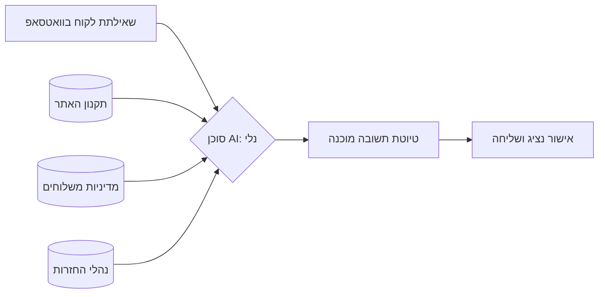

נציגת שירות לקוחות בעסק פיזי כמו מריטל מתמודדת עם עומס קוגניטיבי לא פשוט. בבוקר אחד היא צריכה לענות ללקוח ששואל על מדיניות החזרת מסננים משומשים, בצהריים להתמודד עם תלונה על עיכוב במשלוח לישוב מרוחק, ובערב להסביר את האותיות הקטנות של תקנון המבצע האחרון.

הבעיה היא לא חוסר רצון, אלא זמינות המידע. כדי לתת תשובה מדויקת, נציגת השירות – נקרא לה **נלי** – צריכה לפתוח קבצי PDF של תקנונים, לחפש בטבלאות אקסל של חברות שילוח ולוודא שהיא לא מבטיחה משהו שנוגד את מדיניות החברה. התוצאה היא שהלקוח ממתין "על הקו" או בוואטסאפ דקות ארוכות, והתשובות לא תמיד אחידות או מדויקות משפטית.

החלטנו להפסיק לסמוך על הזיכרון ועל חיפוש ידני בקבצים. במקום זה, ריכזנו את כל "המוח" של שירות הלקוחות במקום אחד נגיש שבו ה-AI כבר מכיר את כל הנהלים מראש.

## הארכיטקטורה: מהלקוח לתשובה חכמה

התהליך שבנינו מבוסס על שילוב של הנחיות התנהגות קבועות (System Prompt) יחד עם בסיס ידע (Knowledge Base) שכולל את כל המסמכים היבשים של העסק. המערכת לא "מנחשת" תשובה אלא סורקת את הקבצים שהעלינו ושולפת את המידע הרלוונטי.

### הפיכת הניירת לסוכן חכם

השלב הראשון היה איסוף כל מסמכי המדיניות: תקנון האתר, מדיניות המשלוחים ונהלי ההחזרות. את כל אלה העלינו כקבצים לתוך ממשקי ה-AI. זה מבטיח שהמודל לא ממציא תשובות, אלא מסתמך אך ורק על המידע המקורי של מריטל.

כדי שהתשובה לא תישמע כמו רובוט משפטי, הגדרנו את פרומפט המערכת. הוא קובע את הטון: **נלי** היא אדיבה ואמפטית, אבל אסרטיבית כשצריך (למשל כשלוקח חורג מהתקנון), עם דגש על כתיבה קצרה שמתאימה לשיחת וואטסאפ עניינית.

## איך מיישמים את זה (גם בחינם)

היופי בטכנולוגיה הזו הוא הנגישות. אין צורך בצוות פיתוח או בתקציבי ענק. ניתן ליישם את זה בשתי פלטפורמות מרכזיות:

### 1. ChatGPT - שימוש ב-Projects

כלי ה-Projects של OpenAI מאפשר לרכז ידע ופרומפטים תחת קורת גג אחת.

* **איך מבצעים:** פותחים Project חדש, מעלים את קבצי המדיניות ללשונית ה-Knowledge ומזינים את הפרומפט של "נלי" בהגדרות הפרויקט.
* **עלות:** זמין גם **במסלול החינמי** (תחת מגבלת כמות הודעות) וגם במסלול ה-Plus. זה מאפשר לכל עסק קטן להתחיל לעבוד עם סוכן חכם ללא עלות ראשונית.

### 2. Gemini - שימוש ב-Gems

בממשק של גוגל, יצרנו **Gem** ייעודי למשרד.

* **איך מבצעים:** יוצרים Gem חדש, מדביקים את ה-System Prompt ומעלים את הקבצים ישירות לתוך ה-Gem (או מחברים ל-Google Drive של המשרד).
* **יתרון:** האינטגרציה עם מסמכי גוגל של העסק הופכת את עדכון הנהלים לפשוט מאוד.

## מספרים ותוצאות מהשטח

המעבר לעבודה עם סוכן AI מבוסס ידע שינה את זרימת העבודה במשרד ובשטח. במקום שהצוות יתקשר למנהל העבודה לשאול "מה עושים אם הלקוח רוצה להחזיר מוצר אחרי 30 יום?", הם פשוט שואלים את נלי.

* **זמן ניסוח הודעה:** ירד מ-5-10 דקות (במקרים מורכבים הדורשים בדיקת תקנון) לפחות מ-30 שניות.
* **דיוק:** 100% התאמה למדיניות המשלוחים (כולל חישוב נכון של עלויות שילוח לאזורים חריגים).
* **עקביות:** כל הלקוחות מקבלים את אותו טון שירותי ומקצועי, ללא קשר לעומס במשרד.
* **עלות:** 0$ עד 20$ בחודש – חיסכון של עשרות שעות עבודה של הצוות.
