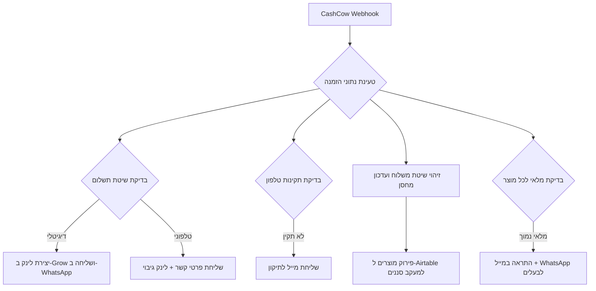

## האתגר

במריטל, העסק המשפחתי שלנו לטיהור מים, החנות הדיגיטלית היא הלב הפועם של המכירות. אבל ככל שהנפח גדל, גילינו ש"הזמנה חדשה" היא רק תחילתו של כאב ראש לוגיסטי. הבעלים, שנמצא רוב היום בשטח בין התקנות ללקוחות, מצא את עצמו חוזר בערב לערימה של מטלות אדמיניסטרטיביות: לוודא שמי שביקש "תשלום טלפוני" אכן שילם, לבדוק למה מספר הטלפון של הלקוח לא תקין, ולנסות להבין לאיזו נקודת איסוף לשלוח את החבילה.

הפתרון הסטנדרטי של גיוס מוקדנית נוספת רק כדי לנהל את הפינג-פונג הזה לא היה רלוונטי מבחינתנו. חיפשנו דרך שבה המערכת תדע לפתור את הבעיות האלו בזמן אמת, כשהלקוח עוד נמצא מול המסך או הנייד.

## הבעיה הסמויה

מעבר לזמן המבוזבז, הבעיה האמיתית הייתה "חורים שחורים" בתהליך המכירה. לקוח שבוחר תשלום טלפוני ושוכח מזה, או לקוח שמזין טלפון שגוי ולא מקבל עדכוני משלוח, הופך מהר מאוד ללקוח לא מרוצה שמתקשר להתלונן. נוצר מצב שבו המקצועיות שלנו בשטח נפגעה בגלל חיכוך טכני פשוט בשלב ההזמנה. הלקוח הרגיש חוסר ודאות, והבעלים הרגיש שחיקה מהתעסקות בזוטות במקום בניהול העסק.

## הפתרון

בנינו מערכת שמקיפה את חנות ה-CashCow שלנו ומתפקדת כ"רשת ביטחון" לכל הזמנה. ברגע שמתקבל Webhook (התראת מערכת) על הזמנה חדשה, המערכת מבצעת סדרה של בדיקות ופעולות אוטונומיות:

### גשר תשלומים חכם

הפלטפורמה שלנו לא תומכת באופן טבעי בשיטות תשלום מודרניות כמו Bit או פייבוקס. השתמשנו במערכת Grow כדי לגשר על הפער. אם האוטומציה מזהה שהלקוח בחר "תשלום דיגיטלי", היא מייצרת עבורו קישור תשלום אישי ושולחת אותו מיד בוואטסאפ. אם הוא בחר "תשלום טלפוני", הוא מקבל הודעה עם פרטי איש הקשר ובמקביל קישור לתשלום עצמי למקרה שהתחרט ורוצה לסיים עם זה עכשיו בלי לחכות לשיחה.

### טיוב נתונים ודיוק לוגיסטי

המערכת מוודאת שהטלפון תקין באמצעות Regex (ביטוי רגולרי). אם המספר חסר או שגוי, נשלח מייל מיידי ללקוח. בנוסף, אם נבחר משלוח לנקודת איסוף, המערכת מאתרת את הנקודה הקרובה ביותר לכתובת המגורים ושולחת אותה לאישור הלקוח, מה שמונע טעויות שילוח יקרות.

### ניתוח פריטים לתחזוקה עתידית

אנחנו לא רק רושמים את ההזמנה. המערכת מבצעת Data Parsing (פירוק נתונים) לפריטים בתוך סל הקניות ומזינה אותם ל-Airtable בצורה מפורקת. כך אנחנו יודעים בדיוק מתי נרכש כל סנן ויכולים לשלוח תזכורות אוטומטיות להחלפה בעוד חצי שנה, לפי סוג המוצר הספציפי.

### התראות מלאי חכמות

כל הזמנה שנכנסת מפעילה גם בדיקת מלאי אוטומטית. המערכת עוברת על כל מוצר בסל הקניות ובודקת את יתרת המלאי בחנות. כשמוצר מתקרב לסף קריטי (למשל, פחות מ-5 יחידות), נשלחת התראה מיידית לבעלים במייל ובוואטסאפ עם שם המוצר, הכמות הנוכחית וקישור ישיר לעמוד הספק לביצוע הזמנה. ככה אפשר לטפל ברכש בזמן אמת, לפי קצב השימוש בפועל, ולא להיתפס עם "אזל מהמלאי" באמצע גל מכירות.

## צלילה טכנית

הלוגיקה מבוססת על תרחיש מרכזי ב-Make.com שמנהל את כל ה-Routing (ניתוב) של ההזמנה.

### הכלים שבמערכת

- **הדבק (Make.com):** חיבור כל המערכות והרצת הלוגיקה.
- **הודעות (GreenAPI):** שליחת הודעות וואטסאפ ישירות למספר הלקוח.
- **הסליקה (Grow-Pay):** מאפשרת לנו לקבל Bit וארנקים דיגיטליים בתוך הזמנת חנות קיימת.
- **הזיכרון (Airtable):** משמש כ-CRM שבו כל פריט מההזמנה מקבל שורה משלו לצורך תזכורות עתידיות.

אחד האתגרים היה לטפל במקרי קצה (Edge Cases) שבהם לקוח לא בטוח לגבי סוג המשלוח. הוספנו אפשרות "צרו איתי קשר" בעמוד התשלום. האוטומציה מזהה את זה ושולחת מיד פירוט מחירי משלוח לפי סכום ההזמנה (אנחנו נותנים הטבות על הזמנות גדולות), מה שמאפשר ללקוח להחליט עוד לפני שנציג אנושי בכלל הרים את הטלפון.

## התוצאה

העלות של המנגנון הזה עומדת על כ-50$ לחודש (חשבון Make ומנוי GreenAPI). עבור העסק, מדובר בהחלפה של חצי משרה לפחות של עבודה אדמיניסטרטיבית שוחקת.

החיסכון האמיתי הוא לא רק בכסף, אלא ביכולת של העסק לגדול. היום אנחנו יכולים לקבל פי 3 יותר הזמנות בלי להוסיף אף עובד למערך השירות או האדמיניסטרציה. הנתונים נכנסים נקיים, התשלומים נסגרים מהר יותר, והלקוח מקבל חוויה של מותג גדול ומקצועי.

נתראה באתגר הבא.
