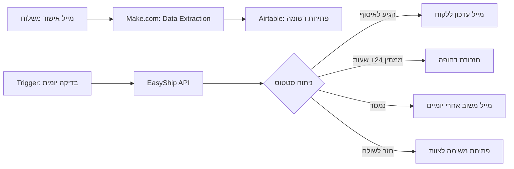

## האתגר

בעסק משפחתי כמו "מריטל", הלוגיסטיקה היא הלב הפועם, אבל היא גם יכולה להיות המקור הכי גדול לכאב ראש. אנחנו מוציאים עשרות משלוחים ביום דרך UPS EasyShip. הבעלים, שנמצא רוב הזמן בדרכים בין התקנות ללקוחות, לא יכול להתחיל לעקוב אחרי כל חבילה וחבילה בממשק של חברת השילוח.

הבעיה האמיתית מתחילה כשהחבילה מגיעה ללוקר או לנקודת חלוקה. ללקוח יש חלון זמן צר — לפעמים פחות מ-48 שעות — לאסוף את המשלוח לפני שהוא מסומן כ"לא נדרש" וחוזר אלינו למחסן. משלוח חוזר כזה הוא הפסד נקי: שילמנו על השילוח הלוך, אנחנו משלמים על החזור, והלקוח עדיין לא קיבל את המסננים שלו.

## הבעיה הסמויה: תקשורת חד-כיוונית

חברת השילוח שולחת SMS ללקוח כשהחבילה מגיעה. אבל כמה לקוחות באמת קוראים את ההודעה? כמה מהם שמים לב שיש להם 48 שעות בלבד? ומה עם לקוחות עם טלפון כשר שבכלל לא מקבלים SMS?

מעבר לעלות הכספית של משלוחים חוזרים, יש כאן פגיעה בתחושת המקצועיות. לקוח שחיכה למשלוח וגילה שהוא חזר בלי שמישהו דיבר איתו, מרגיש ש"נפל בין הכיסאות". רציתי לבנות מערכת שלא רק מונעת את הבעיה, אלא הופכת את הלוגיסטיקה ליתרון שירותי.

## הפתרון: מנגנון ניטור, התראה ומשוב

במקום לחכות שהבעיות יצופו, בניתי מערכת ש"רודפת" אחרי הסטטוסים של EasyShip ופועלת בהתאם לסיטואציה בשטח.

### שלב 1: רישום ותיעוד

התהליך מתחיל במייל אישור המשלוח שיוצא מ-EasyShip. האוטומציה מאזינה לתיבת המייל, שולפת את פרטי הלקוח ומספר ההזמנה, ומזינה אותם לתוך Airtable. זה הופך להיות "לוח המחוונים" שלנו.

### שלב 2: סריקה יומית (Polling)

מכיוון שאין עדכוני מייל על כל שינוי סטטוס, מימשתי עבודה מול ה-API של EasyShip. פעם ביום, המערכת עוברת על כל ההזמנות ב-Airtable שעדיין לא סומנו כ"נמסרו" ובודקת מה המצב שלהן בשרתים של חברת השילוח.

### שלב 3: תגובה לפי תרחיש

כאן נכנסת הלוגיקה העסקית:

- **המשלוח הגיע לנקודת איסוף?** המערכת שולחת מייל אוטומטי ללקוח עם הכתובת המדויקת ותזכורת שיש חלון זמן מוגבל. הלקוח לא תלוי ב-SMS שאולי לא ראה.
- **החבילה ממתינה יותר מ-24 שעות?** המערכת שולחת תזכורת דחופה לאיסוף.
- **המשלוח חזר אלינו?** המערכת פותחת אוטומטית משימה לצוות לתאם משלוח מחדש, עוד לפני שהארגז מגיע פיזית למחסן.

### שלב 4: המינוף — משוב ושיפור שירות

זה הערך האמיתי. יומיים אחרי שהמשלוח נמסר, המערכת שולחת מייל קצר: *"היי, ראינו שהחבילה הגיעה. הכל תקין? המוצרים הגיעו שלמים?"*

ההודעה הזו עושה שני דברים: היא נותנת ללקוח הזדמנות לדווח על בעיה לפני שהוא מתוסכל, והיא בונה תחושה שמישהו באמת עוקב ודואג. זה רגע קסם שבו לוגיסטיקה הופכת לבניית אמון.

## צלילה טכנית

הארכיטקטורה מבוססת על הפרדה בין קליטת הנתונים לבין הניטור השוטף כדי לחסוך ב-Operations (פעולות) במערכת ה-Make.

**רשימת הכלים:**

- **הדבק (Make.com):** מנהל את התזמונים ואת הקריאות ל-API.
- **הזיכרון (Airtable):** משמש כבסיס נתונים לכל המשלוחים הפתוחים.
- **המקור (EasyShip API):** שליפת מידע בזמן אמת על סטטוס החבילה.
- **התקשורת (Gmail API):** שליחת עדכונים ומשובים מותאמים אישית.

האתגר הטכני המרכזי היה ה-API Polling. כדי לא לבזבז משאבים, המערכת מסננת רק את המשלוחים שנוצרו ב-14 הימים האחרונים וטרם נמסרו. השתמשתי בפורמט JSON Output כדי לוודא שהנתונים חוזרים מה-API בצורה שתאפשר ל-Make לעבד אותם בקלות.

## המספרים מדברים

- **עלות:** כמה דולרים בודדים בחודש, בהתאם לכמות המשלוחים.
- **חיסכון ישיר:** צמצום דרסטי במשלוחים שחוזרים למחסן בגלל אי-איסוף.
- **שירות לקוחות:** הלקוחות מקבלים עדכונים במייל בכל שלב, לא תלויים ב-SMS שאולי לא ראו. לקוחות עם טלפון כשר סוף סוף בלופ.
- **משוב:** אנחנו שומעים על בעיות תוך יומיים במקום לגלות אותן בביקורת שלילית.

המערכת הזו הפכה את הלוגיסטיקה שלנו מפעולה פסיבית של "שלח ושכח" לערוץ תקשורת אקטיבי עם הלקוח. אנחנו כבר לא מנחשים איפה החבילה נמצאת — המערכת מדווחת לנו על תקלות עוד לפני שהן הופכות להפסד, ומאפשרת לנו לשאול "איך היה?" בזמן הנכון.

נתראה באתגר הבא.
