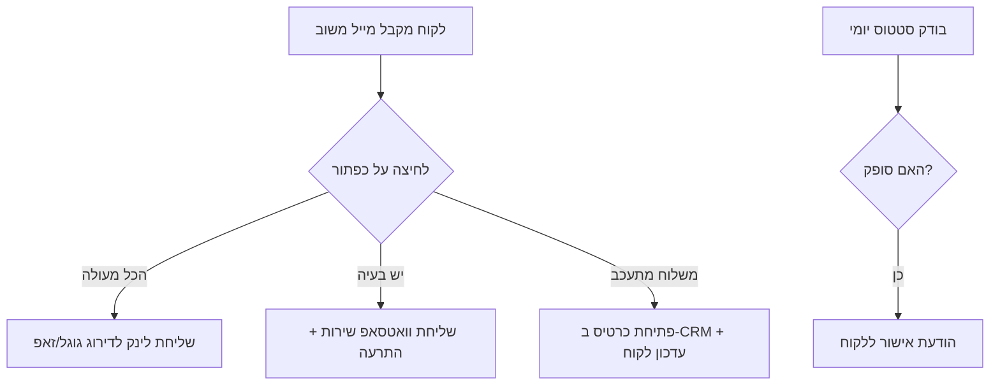

## האתגר

בעסק כמו "מריטל", שבו אנחנו שולחים מערכות טיהור מים ופילטרים לכל הארץ, הרגע שבו החבילה יוצאת מאיתנו הוא תחילתו של "חור שחור". חברת השילוח מעדכנת שהחבילה נמסרה, אבל האם הלקוח באמת קיבל אותה? האם היא הגיעה שלמה? האם הוא בכלל יודע איך להתקין את הפילטר?

הבעלים שלנו נמצא רוב היום בשטח. הוא לא יכול להרים טלפון ל-30 לקוחות ביום כדי לשאול "איך היה?". הפתרון הסטנדרטי הוא לקוות לטוב, או לחכות שהלקוח יתקשר בעצמו כשהוא כבר עצבני כי המשלוח איחר. רציתי ליצור מצב שבו אנחנו מקדימים תרופה למכה, בלי לגייס מוקדנית שירות נוספת שתשב על המיילים.

## הבעיה הסמויה

הבעיה היא לא רק "האם החבילה הגיעה". הבעיה היא חוויית השירות (Customer Experience). לקוח שקיבל משלוח באיחור מרגיש ששכחו אותו. לקוח מרוצה, לעומת זאת, הוא נכס מבוזבז – אם הוא לא דירג אותנו בגוגל או המליץ לחבר באותו רגע, הסיכוי שהוא יעשה זאת אחר כך שואף לאפס. רציתי לסגור את הלופ הזה בצורה דינמית: לתקן כשצריך, ולמנף כשמצליח.

## הפתרון

בניתי מערכת המבוססת על מייל אינטראקטיבי שיוצא ללקוח מיד לאחר שהמערכת מזהה "מסירה". המייל מכיל ארבעה כפתורי פעולה פשוטים. במקום לשלוח את הלקוח לדף "צור קשר" גנרי, כל כפתור מפעיל Webhook ב-Make.com שמתניע תהליך עבודה (Workflow) שונה לחלוטין.

### ניתוב חכם לפי משוב

אם הלקוח לוחץ ש"הכל מעולה", המערכת שולחת לו מייל נוסף עם לינק אישי לדירוג בגוגל ובזאפ. זה קורה תוך שניות, כשהוא עדיין מחויך מהחבילה.

אם יש בעיה או שאלה טכנית, המערכת לא מסתפקת במייל. היא שולחת הודעת וואטסאפ אוטומטית דרך GreenAPI כדי לפתוח ערוץ תקשורת מיידי, כי במיילים דברים הולכים לאיבוד.

במקרה של עיכוב, המערכת פותחת משימה ב-CRM ומעדכנת את הלקוח שאנחנו כבר בבדיקה מול חברת השילוח, כולל קישור למעקב.

### מעקב משלוחים אקטיבי

בנוסף, יצרתי סנריו מקביל שרץ פעם ביום. הוא בודק את כל המשלוחים שסומנו כ"מתעכבים" מול ה-API של חברת השילוח. ברגע שהסטטוס משתנה ל"סופק", המערכת שולחת הודעה ללקוח שמוודאת שהכל תקין – בלי שאיש שירות יצטרך לזכור לעשות את זה.

## צלילה טכנית

הלוגיקה נשענת על ניתוב בקשות HTTP שמגיעות מהקליקים במייל.

### כלים בשימוש

- **Make.com:** המוח שמנהל את הניתובים בין המייל, הוואטסאפ ובסיס הנתונים.
- **GreenAPI:** משמש לשליחת הודעות וואטסאפ ללקוחות שדיווחו על תקלה.
- **Holiday Checker (Custom API):** בבדיקת המשלוחים המתעכבים, המערכת משתמשת בסקריפט PHP שבודק חגים ומועדים בישראל כדי לא להגדיר ימי חג כימי עיכוב מיותרים.

האתגר המרכזי היה בניסוח הודעות הוואטסאפ. רציתי שהן ירגישו אישיות ולא כמו בוט. השתמשתי בנתונים מההזמנה (שם הלקוח, סוג המוצר) כדי להרכיב הודעה בסגנון *"היי אפרת, ראינו שסימנת שיש שאלה לגבי המשלוח, נטלי כאן לעזור"*.

## המספרים מדברים

- **זמן:** נחסכו כ-4 שעות שבועיות של מעקב ידני וטלפונים לבירור סטטוס.
- **שירות:** 100% מהלקוחות שדיווחו על בעיה קיבלו מענה ראשוני תוך פחות מ-2 דקות.
- **שיווק:** עלייה של כ-20% בכמות הביקורות החיוביות בגוגל, פשוט כי ביקשנו בזמן הנכון.

הערך האמיתי הוא השקט של הבעלים. הוא יודע שגם כשהוא נוהג בדרכים, המערכת מוודאת שאף לקוח לא נשאר עם חבילה פגומה או הרגשה שמתעלמים ממנו.

נתראה באתגר הבא.
