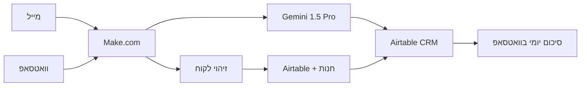

## האתגר

בעסקי שירות והתקנות, הצמיחה מביאה איתה תופעת לוואי מסוכנת: אובדן שליטה. הסיטואציה בשטח מוכרת לכל מי שעוסק בתחום: הטכנאי נמצא מתחת לכיור אצל לקוח, הידיים רטובות או מלוכלכות, והטלפון מצפצף. הוא לא יכול לפתוח מחשב ולתעד קריאה.

התוצאה היא כאוס תקשורתי. פניות על נזילות, בקשות למוצרים או קריאות שירות זורמות במקביל בווטסאפ, במיילים ובשיחות טלפון. כשהמנהל בשטח מפספס הודעת ווטסאפ קריטית כי נכנסו אחריה עוד 30 הודעות מקבוצות אחרות, זה לא סתם חוסר סדר – זה לקוח שנופל בין הכיסאות ומרגיש ששכחו אותו.

## הבעיה הסמויה: "אפקט הזיכרון הקצר"

האתגר האמיתי הוא לא רק תיעוד המידע, אלא ההקשר (Context). לקוח כותב בווטסאפ: "זה שוב נוזל". מי הלקוח? מה הכתובת? מתי הותקנה המערכת? איזה דגם יש לו? בלי מוקד אנושי שיושב מול מסכים, איש השטח צריך לנבור בהיסטוריה של הווטסאפ תוך כדי נהיגה או עבודה כדי להבין במי מדובר. זה שוחק, זה מבזבז זמן יקר, וזה פוגע במקצועיות.

החלטתי לעצור את האלתור. במקום לגייס מזכירה שתשב ותקליד נתונים, בניתי מערכת שמתפקדת כ"מוקדנית דיגיטלית" ועובדת 24/7.

## הפתרון: סנכרון רב-ערוצי ל-CRM

הקמתי ב-Make.com אוטומציה שמרכזת את כל ערוצי התקשורת לתוך Airtable. המטרה: כל פנייה – לא משנה מאיפה הגיעה – הופכת לרשומה מסודרת עם כל הפרטים הטכניים, ללא מגע יד אדם.

חילקתי את הפתרון לשלושה צירים מרכזיים:

### הציר הראשון: המייל הופך למשימה מנותחת

כשלקוח שולח מייל, המערכת שולפת את התוכן ושולחת אותו לניתוח אצל Gemini 1.5 Pro. ה-AI לא רק "מעתיק" את הטקסט; הוא מנתח את מהות התקלה ומקטלג אותה (למשל: "דחיפות גבוהה", "החלפת סננים"). הניואנס הארגוני: מכיוון שהצוות הטכני שלנו כולל דוברי שפות שונות (רוסית/עברית), הוספתי הנחיה (Prompt Engineering) לייצר סיכום דו-לשוני אוטומטי לכל קריאה. המערכת מזהה את הלקוח לפי המייל ופותחת קריאת שירות מקושרת לתיק שלו.

### הציר השני: הווטסאפ והזיכרון הארוך

זה היה האתגר המורכב יותר. הודעת ווטסאפ בודדת היא לרוב חסרת ערך בלי ההקשר ההיסטורי. בניתי לוגיקה שמושכת את היסטוריית השיחות של ה-30 ימים האחרונים עם אותו מספר. כשהלקוח כותב "זה לא עובד", ה-AI מקבל את כל ההיסטוריה, מבין שמדובר על מערכת אוסמוזה שהותקנה לפני שבוע, ומחלץ את שם הלקוח והכתובת מתוך המערכות שלנו.

### הציר השלישי: סיכום יום למנהל

בכל ערב, המערכת מריצה בדיקה על כל התקלות שעדיין בסטטוס "חדש" או "בטיפול". היא שולחת הודעת ווטסאפ מרוכזת למנהל עם קישור ישיר לניהול התקלות. כך סוגרים את היום ב-5 דקות של תכנון לו"ז, במקום שעה של חיפוש הודעות אבודות.

## מתחת למכסה המנוע

- **הסטאק:** Make.com, Gemini 1.5 Pro (API), Airtable, GreenAPI (לניהול הווטסאפ).
- **זיהוי לקוח:** כדי לחבר את הנקודות, פתחתי שירות פנימי (Microservice) שנכתב כולו על ידי Claude. השירות מקבל מספר טלפון או מייל, ורץ למשוך את כל המידע הרלוונטי משני מקורות במקביל: גם מ-Airtable (ה-CRM) וגם ישירות מממשק החנות שלנו. הוא מחזיר בשניות פרופיל מלא של הלקוח וההזמנות שלו.
- **Prompt Engineering:** השתמשתי בפורמט JSON Output קשיח בהנחיה ל-AI. זה קריטי כדי שהמידע (שם הלקוח, סוג התקלה, דחיפות) יזרום ישירות לשדות הנכונים ב-Airtable בלי שהמודל "יקשקש" טקסט חופשי שישבור את האוטומציה.

## המספרים מדברים

- **עלות תפעולית:** כמה דולרים בודדים בחודש (תשלום לפי שימוש ב-API). זניח לחלוטין לעומת עשרות שעות העבודה האדמיניסטרטיבית שזה חוסך בכל חודש.
- **זמן תגובה:** צמצמנו כמעט לאפס את הסיכוי לפספס פניות. שיטת העבודה היא "שגר ושכח" – הלקוח פונה, המערכת קולטת וממיינת.
- **ROI:** מעבר לחיסכון הכספי, הרווח הגדול הוא השקט התפעולי. המנהל בשטח יודע ששום דבר לא נופל בין הכיסאות, גם בימים העמוסים ביותר.

## סיכום

האוטומציה הזו לא נועדה להחליף את הקשר האישי עם הלקוחות, אלא בדיוק להפך: היא משחררת את אנשי המקצוע מהתסכול של להיות "מנהלי משרד" בעל כורחם. כשהמידע מסודר ונגיש, אפשר להתמקד במה שחשוב באמת – לתת שירות מקצועי ומהיר.
