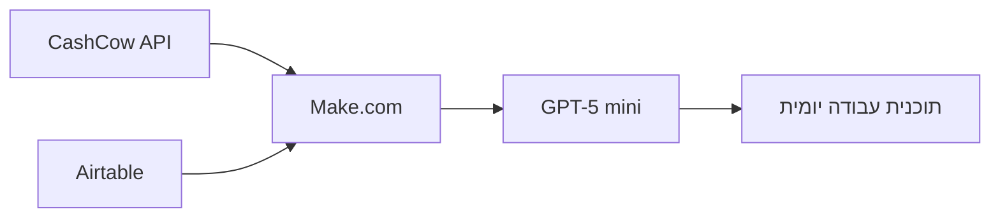

## האתגר

בעסק של שירות והתקנות, האויב הכי גדול ליעילות הוא הכביש. כשהעסק גדל, זיהינו שמשאב יקר מאוד – הזמן של המתקינים והטכנאים הבכירים – נשרף על ההגה במקום על עבודה מקצועית.

התרחיש הקבוע היה מתסכל לוגיסטית: נקבעה התקנה בירושלים. הטכנאי יוצא מהמרכז, שורף שעה וחצי בפקקים, מבצע את העבודה וחוזר. רק כשהוא מגיע חזרה למשרד (או כשמסתכלים בדוחות בסוף יום), מגלים שבמערכת היו פתוחות עוד שלוש קריאות שירות באזור מבשרת ציון ובית שמש. הן חיכו ל"הזדמנות", אבל המידע הזה היה מפוזר ולא הגיע למי שקובע את הלו"ז בזמן אמת. התוצאה: נסענו, חזרנו, ומחר נצטרך לנסוע שוב לאותו אזור בדיוק.

## הבעיה הנסתרת: הלקוח שמתייאש

מעבר לבזבוז המשווע של דלק וזמן עבודה, הבעיה האמיתית היא חווית השירות. לקוח שגר ליד ההתקנה של אתמול ושומע "אנחנו נהיה באזור שלך רק בשבוע הבא", הוא לקוח בסיכון. פספסנו הזדמנות לתת לו שירות "על הדרך" ולסגור טיפול מהיר. כשהלוגיסטיקה לא מסונכרנת, העסק מפסיד פעמיים: גם ברווחיות של הנסיעה וגם במוניטין מול הלקוח.

## הפתרון: סדרן עבודה דיגיטלי

ההבנה הייתה שלא צריך עוד רכבים, צריך לוגיקה שמחברת נקודות. המטרה: לבנות כלי שמרכז את כל הדאטה העסקי למסך אחד, ונותן למנהל העבודה לקבל החלטות מבוססות מיקום גיאוגרפי בזמן אמת.

בניתי ממשק ייעודי לניהול הלו"ז. המשתמש מזין "עיר עוגן" (למשל: ירושלים) ותאריך יעד. המערכת סורקת מיידית את כל המאגרים של החברה ומציגה תוכנית עבודה אופטימלית שכוללת: התקנות חדשות, תקלות שירות פתוחות, ואפילו משלוחים. הבונוס הכלכלי: המערכת בודקת גם הזמנות של מוצרים (סננים/חלפים) שצריכים להישלח לאותו אזור. אם הטכנאי כבר שם? הוא מבצע את המסירה. חסכנו חברת שליחויות, והלקוח קיבל את המוצר מהר מהצפוי.

## מאחורי הקלעים

למי שרוצה לממש לוגיקה כזו, זה לא דרש הטמעה של מערכת שילוח ב-50 אלף שקל. השתמשתי בארכיטקטורה מבוססת Make.com שמושכת מידע משני מקורות במקביל:

- **CashCow API:** הזמנות חדשות ומשלוחים.
- **Airtable:** התקנות חדשות, קריאות שירות פתוחות, העדפות תיאום של לקוחות והיסטוריית לקוחות. את העדפות התיאום אנחנו אוספים מהלקוחות באמצעות טופס שנשלח בוואטסאפ (על זה בפוסט נפרד).

את כל הנתונים האלו אני מזרים לתוך GPT-5-mini. זה המודל שנבחר למשימה כי הוא משלב מהירות עם יכולת הסקה גבוהה מאוד. כתבתי לו פרומפט עם "לוגיקת בחירה" קשוחה: הוא יודע לתעדף לקוחות בסטטוס "דחוף", לחשב רדיוס הגיוני סביב עיר העוגן, ולפלוט המלצות לסידור עבודה יומי בפורמט JSON נקי.

הטוויסט בפיתוח: את הממשק (Frontend) למשתמש ואת החיבורים הטכניים בין המערכות, בניתי בעזרת Claude Code. זה סוכן AI שרץ בטרמינל ופשוט "תופר" את הקוד וחיבורי ה-Webhooks במהירות שיא. זה חסך את כל העבודה השחורה של בניית ה-UI ואפשר להתמקד נטו בלוגיקה העסקית.

## שורה תחתונה

- **עלות:** תשלום לפי צריכה (Pay-as-you-go) ל-API. העלות החודשית זניחה לעומת המחיר של מיכל דלק אחד.
- **חיסכון בזמן:** תהליך תכנון הלו"ז היומי התקצר משעה לכמה דקות.
- **יעילות:** ירדנו ב-20% בהיקף נסיעות הסרק, וזמן המענה ללקוחות באזורים מרוחקים התקצר משמעותית.

בסופו של דבר, המערכת הזו מוודאת שכאשר רכב של החברה כבר יוצא לשטח, הוא ממצה את הפוטנציאל הכלכלי של הנסיעה עד השקל האחרון.

נתראה באתגר הבא.
