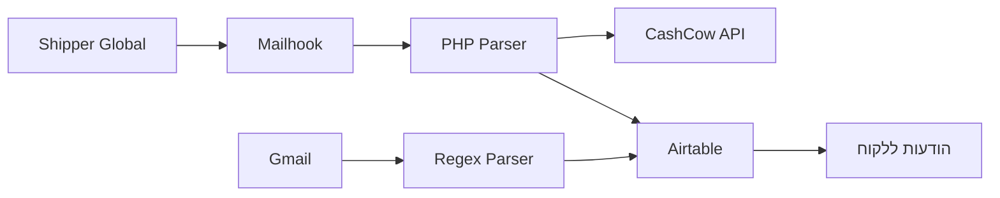

## האתגר

בעסק של שירות והתקנות, הצוות המקצועי נמצא רוב הזמן בשטח. כשהם באמצע יום עבודה עמוס אצל לקוחות, אין להם את הפריווילגיה (או את הזמן) לעצור הכל כדי לבצע בירור לוגיסטי מורכב.

התרחיש הוא קבוע: לקוחה מתקשרת לברר מה קורה עם המסננים שהזמינה. כדי לתת לה תשובה, איש הצוות צריך להתנתק מהעבודה, להיכנס לממשק של Shipper Global, להעתיק קוד מעקב, להשוות אותו למערכת ההזמנות, ורק אז לחזור אליה. כשיש עשרות משלוחים ביום, ה"פינג-פונג" הזה בין מערכות שונות שואב זמן יקר ויוצר צוואר בקבוק בשירות.

## הבעיה השקופה: חוסר ודאות

הבעיה היא לא רק הזמן האבוד, אלא ה"חור השחור" שבין ההזמנה לקבלה. הלקוח הממוצע, שרגיל לסטנדרט של אמזון, מצפה לשקיפות מלאה. כשהוא צריך להתקשר כדי לשאול "איפה החבילה שלי?", מבחינתנו זה כבר כשל שירותי.

רצינו להגיע למצב שהמידע זורם ללקוח ולנו אוטומטית, בלי שנצטרך לחפש אותו.

## הפתרון: מגדל פיקוח לוגיסטי אוטומטי

בניתי מערכת שמתממשקת ל-Shipper Global, מרכזת את המידע בזמן אמת והופכת את הלוגיסטיקה מכאב ראש ליתרון שירותי. התהליך עובד בשלושה שלבים:

### שלב 1: סנכרון ורישום אוטומטי

ברגע שמשלוח מוזן במערכת של Shipper Global, האוטומציה "תופסת" אותו מיידית. היא מבצעת שתי פעולות במקביל:

- **Airtable:** שומרת את המשלוח למעקב בלוח הבקרה הפנימי שלנו.
- **CashCow:** מעדכנת את פלטפורמת החנות בסטטוס "נשלח" ובמספר המעקב, כך שהלקוח רואה את המידע באזור האישי שלו מיד.

### שלב 2: מעקב היברידי (פנימי וחיצוני)

מרגע זה, המערכת עוקבת אחרי החבילה. אנחנו יכולים לראות ב-Airtable תמונת מצב מלאה של כל המשלוחים הפתוחים, ולהוציא מיילים או הודעות יזומות ללקוח בהתאם לסטטוס (למשל: "המשלוח בדרך אליך"), בלי להסתמך רק על ההודעות הגנריות של חברת השליחויות.

### שלב 3: שירות לקוחות פרואקטיבי

זה הערך האמיתי. המערכת מאפשרת לנו להקדים תרופה למכה – או למנף הצלחה:

- **במקרה של עיכוב:** המערכת מזהה "תקיעה" בסטטוס ומתריעה לנו פנימית, כדי שנוכל ליצור קשר עם הלקוח ולהרגיע אותו לפני שהוא מתקשר לכעוס.
- **במקרה של מסירה:** 3 ימים אחרי שהסטטוס משתנה ל"נמסר", המערכת שולחת הודעה אוטומטית: *"היי, ראינו שהחבילה הגיעה. הכל תקין? צריכה עזרה בהתקנה?"*. זה רגע קסם שבו הלוגיסטיקה הופכת לבונה אמון.

## מתחת למכסה המנוע

המערכת מבוססת על שני תהליכים (Scenarios) ב-Make.com:



### תהליך א': קליטת המשלוח (Data Parsing)

השתמשתי ב-Mailhook שקולט את אישור המשלוח שמגיע מ-Shipper Global. האתגר הטכני: המידע במייל מגיע בפורמט לא מסודר. כתבתי סקריפט PHP קטן שיושב על השרת שלנו, מנקה את הטקסט, ושולף את קוד המעקב בצורה נקייה כדי לעדכן את החנות דרך ה-API.

### תהליך ב': האזנה לשינויים (Regex Magic)

חברת השילוח שולחת עדכונים במייל. השתמשתי במודול שסורק תיקייה ספציפית ב-Gmail. בעזרת Regex (ביטוי רגולרי) אני שולף מהנושא (Subject) את הסטטוס החדש ואת מספר המשלוח:

```
Shipment Status Update - (.*?) - ([A-Z0-9]+)$
```

המערכת רצה ל-Airtable, מוצאת את המשלוח הרלוונטי ומעדכנת סטטוס. אם הסטטוס הוא `Delivered`, היא מפעילה טיימר להודעת "בקרת איכות" שתישלח בעוד 3 ימים.

## המספרים מדברים

- **עלות תפעולית:** קרוב ל-0$ (הכל רץ על התוכניות הבסיסיות של Make ו-Airtable).
- **חיסכון בזמן:** חסכנו את כל "זמן הבירורים" הטלפוני. הצוות בשטח לא מתעסק בלוגיסטיקה.
- **ערך מוסף:** שירות לקוחות שיוזם ולא רק מגיב. הלקוחות מרגישים שיש אבא ואמא למשלוח, גם אם הזמינו ב-50 שקל.

## סיכום

המטרה הייתה לשחרר את הצוות המקצועי מעיסוק ב"איפה החבילה", ולתת ללקוחות תחושת ביטחון. המערכת הזו עובדת ברקע, בשקט, ודואגת שגם כשאנחנו עסוקים מעל הראש, אף משלוח לא נופל בין הכיסאות.
